# Design Document

## Overview

This design describes the **verification architecture** for sixteen fixes that have already been applied to the AffiliteMix codebase. The goal is not to re-implement the fixes but to define, for each requirement, the automated check that confirms the documented behavior holds today and fails loudly if a future change regresses it.

The codebase is a Next.js (React 19) application deployed on Cloudflare, backed by Supabase, with three test layers already in place:

- **Vitest** (`npm test` → `vitest run`) for unit, integration, and static-source assertions. The repo already uses Vitest extensively (e.g., `__tests__/analytics-domains-superadmin.test.ts`, `__tests__/audit3-locks.test.ts`).
- **Playwright** (`npm run test:e2e`) for end-to-end browser flows. The admin-login flow lives in `e2e/admin-login.spec.ts`; the site-manager flow in `e2e/admin-site-manager-delete.spec.ts`.
- **No property-based testing harness exists yet.** A grep for `fast-check` returns nothing. Where this design calls for property-based tests, it introduces [`fast-check`](https://fast-check.dev/) as a dev dependency, driven by the existing Vitest runner (the idiomatic pairing for the TS/Vitest stack).

### Verification strategy by group

The requirements split cleanly along the line that determines _what kind_ of verification is appropriate:

| Group | Requirements | Nature of fix                                                                                                                                      | Primary verification                                                                                                                              |
| ----- | ------------ | -------------------------------------------------------------------------------------------------------------------------------------------------- | ------------------------------------------------------------------------------------------------------------------------------------------------- |
| A     | R1–R8        | Playwright E2E corrections (assertions, JWT audience, CSP/hydration, selectors, navigation waits, force-hover) and one pure helper (`isLoginPage`) | E2E example checks + Playwright config assertions; **property-based** test for `isLoginPage`                                                      |
| B     | R9–R16       | Application logic: analytics correctness, dead-code removal, error surfacing, hydration stability                                                  | **Property-based** tests for pure aggregation/formatting logic; mocked-fetch handler tests; static-source/build checks; SSR/CSR markup comparison |

The decisive question for each criterion is: _does the behavior vary meaningfully with input, and is it cheap to exercise many times?_ Pure functions that satisfy both — `isLoginPage` (R6), EPC aggregation (R9), AOV computation (R11), and timezone-stable date formatting (R16.2/16.3) — are verified as properties. Everything that depends on the browser, external services, the build toolchain, or fixed configuration is verified with representative examples, mocked-fetch handler tests, static-source assertions, or snapshot comparisons.

### Key constraint: one regression → one failing requirement

Each requirement is scoped to a single fix. The verification suite mirrors that scoping: each requirement maps to a dedicated test (or a tight cluster of tests in one file) so that a regression in any one fix surfaces as exactly one failing requirement, never a cascade.

## Architecture

### Test topology

```mermaid
flowchart TD
    subgraph Vitest["Vitest runner (npm test)"]
        PBT["Property-based tests (fast-check)"]
        UNIT["Example / edge unit tests"]
        STATIC["Static-source & build checks"]
        HANDLER["Mocked-fetch handler tests (jsdom)"]
        SSR["SSR/CSR markup comparison (renderToString vs hydrateRoot)"]
    end
    subgraph Playwright["Playwright runner (npm run test:e2e)"]
        E2E["Admin-login & site-manager E2E specs"]
        CFG["playwright.config.ts assertions"]
    end

    PBT --> R6["R6 isLoginPage"]
    PBT --> R9["R9 EPC per link group"]
    PBT --> R11["R11 AOV"]
    PBT --> R16f["R16.2/16.3 date format stability"]

    UNIT --> R10e["R10 client-injection / zero-records / error"]
    UNIT --> R11e["R11 empty / query-failure flags"]
    STATIC --> R10a["R10 allowlist + SEC-03 cap"]
    STATIC --> R12["R12 dead-code removal + build"]
    HANDLER --> R13["R13 page reorder"]
    HANDLER --> R14["R14 AI-content delete"]
    HANDLER --> R15["R15 affiliate-network delete"]
    SSR --> R16c["R16 card hydration"]

    E2E --> RA["R1,R2,R3,R4,R5,R7,R8"]
    CFG --> R3c["R3.1 bypassCSP"]
```



### Where each behavior lives in the codebase

| Requirement | Subject under verification                     | Source location                                                                                                                                 |
| ----------- | ---------------------------------------------- | ----------------------------------------------------------------------------------------------------------------------------------------------- |
| R1, R3–R5   | Admin-login E2E assertions/waits               | `e2e/admin-login.spec.ts`                                                                                                                       |
| R2          | Test JWT audience `affilite-mix-admin`         | `e2e/admin-login.spec.ts` (`mintAdminJwt`), server side `lib/auth.ts`                                                                           |
| R3.1        | CSP bypass for browser context                 | `playwright.config.ts` (`use.bypassCSP`)                                                                                                        |
| R3.2        | Hydration signal `body[data-e2e-hydrated="1"]` | `app/q7m-k4j9/login/page.tsx`, asserted in `e2e/admin-login.spec.ts`                                                                            |
| R6          | `isLoginPage` URL predicate                    | currently inline in `e2e/admin-site-manager-delete.spec.ts`; design extracts a pure helper                                                      |
| R7, R8      | Navigation waits, force-hover                  | `e2e/admin-site-manager-delete.spec.ts` and related admin specs                                                                                 |
| R9          | EPC per link group                             | `app/api/cron/epc-recompute/route.ts`, `lib/dal/commissions.ts` (`upsertProductEpc`)                                                            |
| R10         | Domain rollup via injected privileged client   | `lib/dal/analytics-dashboard.ts` (`getDomainPerformance`), `app/api/admin/analytics/domains/route.ts`, `lib/security/service-role-allowlist.ts` |
| R11         | AOV from real commissions                      | `lib/dal/analytics-dashboard.ts` (`getAnalyticsSummary`)                                                                                        |
| R12         | Dead response-HMAC removal                     | repo-wide; anchor comment in `app/api/cron/commission-ingest/route.ts`                                                                          |
| R13         | Page reorder error surfacing                   | `app/q7m-k4j9/(dashboard)/pages/page-manager.tsx`                                                                                               |
| R14         | AI-content delete error surfacing              | `app/q7m-k4j9/(dashboard)/ai-content/ai-content-manager.tsx`                                                                                    |
| R15         | Affiliate-network delete error surfacing       | `app/q7m-k4j9/(dashboard)/affiliate-networks/affiliate-network-manager.tsx`                                                                     |
| R16         | Hydration-stable time rendering                | `app/(public)/components/product-card.tsx`, `app/(public)/components/content-card.tsx`                                                          |

### Design decision: extracting `isLoginPage` as a pure helper

Today the only `isLoginPage` is an `async` function in `e2e/admin-site-manager-delete.spec.ts` that takes a Playwright `Page` and races a URL/visibility check. R6 specifies a _pure_ predicate over a URL string with explicit null/undefined/non-string handling — exactly the shape that property-based testing targets. The design therefore extracts the URL-matching core into a synchronous, dependency-free helper:

```
e2e/helpers/is-login-page.ts
  export function isLoginPage(url: unknown): boolean
```

The existing async page-aware guard is refactored to call this pure helper for its URL check, preserving current E2E behavior while making the substring logic independently testable with generated inputs. This is the only structural change the verification work introduces; every other fix is verified in place.

## Components and Interfaces

### `isLoginPage` pure helper (R6)

```typescript
// e2e/helpers/is-login-page.ts
const LOGIN_SEGMENT = "/q7m-k4j9/login"; // case-sensitive Obfuscated_Admin_Path segment

export function isLoginPage(url: unknown): boolean {
  if (typeof url !== "string" || url.length === 0) return false;
  return url.includes(LOGIN_SEGMENT);
}
```

- Returns `true` only when the case-sensitive substring `/q7m-k4j9/login` is present.
- Returns `false` for `/admin/login` (which lacks the obfuscated segment), for any string lacking the segment, and for `null`, `undefined`, empty string, or non-string input — never throwing.

### `getDomainPerformance` client injection (R10)

The function already accepts a `DalClientGetter` with a default; verification confirms the contract rather than changing it:

```typescript
// lib/dal/analytics-dashboard.ts (already applied)
export async function getDomainPerformance(
  sinceIso: string,
  getClient: DalClientGetter = defaultDalClientGetter,
): Promise<DomainPerformanceRow[]>;
```

The route wires the privileged client:

```typescript
// app/api/admin/analytics/domains/route.ts (already applied)
const domains = await getDomainPerformance(since.toISOString(), getPrivilegedSupabaseClient);
```

Verification injects a **fake `DalClientGetter`** returning an in-memory stub of `listSites` + `getClickCount` results, so the rollup logic is exercised without any real Supabase or network call. The error path (R10.9) injects a getter that returns an unusable client.

### Admin delete/reorder handlers (R13–R15)

These are `"use client"` React components whose handlers call `fetchWithCsrf` and branch on `res.ok`. Verification renders the component (or invokes the handler) in **jsdom** with a mocked `fetchWithCsrf`/`fetch` and asserts the resulting `setError`/list state. The relevant already-applied shapes:

- `page-manager.tsx`: `handleMoveUp`/`handleMoveDown` guard `reorderingRef.current`, check `res.ok`, `setError("Could not save the new order.")` and `loadPages()` on failure, and early-return at list boundaries.
- `ai-content-manager.tsx`: `handleDelete` checks `res.ok`, extracts `data.error` (default `"Delete failed"`), and only calls `onRefresh()` on success.
- `affiliate-network-manager.tsx`: `handleDelete` checks `res.ok`, `setError("Failed to delete")` on non-OK, retains the item, and only `onRefresh()`s on success.

### Card components (R16)

- `product-card.tsx`: `mounted` flag (`useState(false)` + `useEffect(() => setMounted(true), [])`) gates `showDeal` and `dealTimeLeft`, so no `new Date()`-dependent output renders during SSR.
- `content-card.tsx`: date is formatted via `toLocaleDateString(locale, { timeZone: "UTC" })` with `locale` defaulting to `"en-US"`; the `<time>` element is only rendered when `publish_at ?? created_at` is present.

## Data Models

The verification suite introduces no production data models. It defines test-only fixtures and generators.

### Generated input domains (property-based tests)

```typescript
// R6 — isLoginPage
type UrlInput =
  | string // arbitrary URLs, some containing "/q7m-k4j9/login", some "/admin/login"
  | null
  | undefined
  | number
  | object; // non-string inputs

// R9 — EPC link grouping
interface AffiliateLinkFixture {
  site_id: string;
  product_id: string;
  network: string;
  url: string; // distinct per link within a group
}
interface ClickFixture {
  affiliate_url: string;
} // may match any url in a group
interface CommissionFixture {
  product_id: string;
  network: string;
  commission_amount: number | undefined;
}

// R11 — AOV
interface SaleFixture {
  sale_amount: number;
  event_date: string;
} // within/outside the period window

// R16 — date formatting
type Timestamp = string; // ISO-8601 instants across day boundaries and time zones
```

### Test doubles

```typescript
// Injected DalClientGetter stub (R10, R11)
type FakeClient = {
  listSites: () => SiteRow[];
  clickCounts: Record<string /*siteId*/, number>;
  commissions: SaleFixture[];
  failClientRetrieval?: boolean; // drives R10.9 / R11.3
};
```

### Domain-performance row (existing, asserted by R10)

```typescript
interface DomainPerformanceRow {
  siteId: string;
  slug: string;
  name: string;
  domain: string;
  clicks: number;
  revenue: number;
}
```

## Correctness Properties

_A property is a characteristic or behavior that should hold true across all valid executions of a system — essentially, a formal statement about what the system should do. Properties serve as the bridge between human-readable specifications and machine-verifiable correctness guarantees._

These properties cover the subset of fixes that are **pure, input-varying logic**: the `isLoginPage` URL predicate (R6), the EPC link-group aggregation (R9), the AOV computation (R11), the domain rollup over injected data (R10.3/10.8), and timezone-stable date formatting (R16.2/16.3). The remaining requirements (E2E corrections, static-source/build checks, mocked-fetch handler behavior, SSR/CSR snapshot comparison) are not amenable to property-based testing and are verified as described in the Testing Strategy.

Each property below is implemented by a single property-based test using `fast-check` driven by Vitest, configured for a minimum of 100 iterations.

### Property 1: `isLoginPage` matches exactly the obfuscated login segment

_For any_ input value, `isLoginPage` returns `true` if and only if the input is a string containing the case-sensitive substring `/q7m-k4j9/login`; for every other input — including strings containing `/admin/login` but not the obfuscated segment, arbitrary strings lacking the segment, `null`, `undefined`, the empty string, and non-string values — it returns `false` without throwing.

**Validates: Requirements 6.1, 6.2, 6.3, 6.4**

### Property 2: Affiliate links partition into link groups by their tuple

_For any_ set of affiliate links, the grouping step assigns each link to exactly one Link_Group keyed by `(site_id, product_id, network)`, such that the groups are disjoint, their union is the original link set, and two links share a group if and only if they share the same tuple.

**Validates: Requirements 9.1**

### Property 3: A group's click count is the deduplicated total over its URLs

_For any_ set of affiliate links and clicks, the click count stored for a Link_Group equals the number of clicks whose target URL is one of the group's URLs, with each click counted at most once even when the group has multiple URLs.

**Validates: Requirements 9.2, 9.4**

### Property 4: Exactly one upsert per link group per run

_For any_ set of affiliate links, an aggregation run performs exactly one `upsertProductEpc` call per distinct Link_Group, so the number of upserts equals the number of distinct `(site_id, product_id, network)` tuples.

**Validates: Requirements 9.3**

### Property 5: EPC is earnings over clicks, with safe zero/missing handling

_For any_ commission earnings (possibly missing/undefined) and total click count, EPC equals `round_half_up(earnings / clicks, 2)` when clicks > 0, equals `0` when clicks = 0 (no division error), and treats missing or undefined earnings as `0`.

**Validates: Requirements 9.5, 9.6, 9.7**

### Property 6: Domain rollup reflects the underlying per-site data

_For any_ set of per-site click counts and revenue-per-click rates supplied through an injected privileged client, `getDomainPerformance` returns one row per site whose `clicks` equals the injected click count and whose `revenue` equals `round(clicks * rate, 2)`; the result is all-zero when and only when every injected click count is zero.

**Validates: Requirements 10.3, 10.8**

### Property 7: AOV includes only commissions within the period window

_For any_ set of commissions with sale timestamps, AOV is computed using exactly those commissions whose timestamp falls within `[start, end)` — inclusive of the start, exclusive of the end — and ignores all commissions outside that window.

**Validates: Requirements 11.1**

### Property 8: AOV is the mean sale amount over the period

_For any_ non-empty set of in-window commissions, AOV equals `round(sum(sale_amount) / order_count, 2)`.

**Validates: Requirements 11.2**

### Property 9: Card date formatting is timezone-stable

_For any_ timestamp, the content-card's formatted date equals the result of `toLocaleDateString("en-US", { timeZone: "UTC" })` for that timestamp and is invariant under the ambient/process time zone, so server-rendered and client-rendered output for the time-dependent text are identical.

**Validates: Requirements 16.2, 16.3**

## Error Handling

The verification suite asserts that the documented error and boundary behaviors are surfaced, not swallowed:

- **JWT rejection (R2.3, R2.4):** unit tests confirm `verifyToken` rejects mismatched, missing, and empty `aud` claims without establishing a session.
- **Domain-rollup client failure (R10.9):** an injected `DalClientGetter` returning an unusable client must cause `getDomainPerformance` to surface a client-retrieval error and return no rows. The test asserts the error path is taken rather than silently returning zeros.
- **AOV query failure vs. empty period (R11.3, R11.4):** the two zero-valued outcomes must be distinguishable. Tests inject (a) a failing commissions query and assert AOV `0` with a _query-failure_ indication and no partial results, and (b) an empty in-window result and assert AOV `0` with an _empty-period_ indication. Note: the current `getAnalyticsSummary` implementation collapses both to `0` inside a `try/catch` without a distinguishing flag; verification of R11.3/R11.4 therefore asserts the _required_ distinguishable indication and will fail until the flag is present — this is the intended regression signal for that requirement.
- **Reorder failures (R13.1, R13.4, R13.5):** non-OK responses and network rejections must call `setError` and reload via `loadPages` to restore the persisted order; tests assert both the error message and the reload.
- **Delete failures (R14, R15):** non-OK responses must extract the server message (or fall back to a default/generic message), call `setError`, and keep the target item in the list; network rejections must report "could not be completed" and keep the item. Tests assert the item is retained on every failure branch.
- **Playwright timeouts (R1.5, R3.5, R4.3, R4.4, R5.4, R7.4, R7.5, R8.3):** these rely on Playwright's built-in assertion/locator/navigation timeout failures; the verification confirms the correct wait conditions and timeouts are configured so failures report the expected diagnostic.

## Testing Strategy

### Dual approach

- **Property-based tests** (fast-check + Vitest) cover the nine properties above — the pure, input-varying logic.
- **Example, edge-case, integration, and smoke tests** cover the remaining requirements where behavior is fixed, browser-dependent, or configuration-level.

### Property-based testing

PBT **is** appropriate here for `isLoginPage`, EPC aggregation, AOV, the domain rollup (via an injected fake client), and date formatting — all pure functions or logic exercised through dependency injection with no real I/O.

PBT **is not** appropriate for the E2E corrections (R1–R5, R7, R8 — browser/framework behavior), the static-source and build checks (R10.4–10.7, R12 — fixed configuration/toolchain), the mocked-fetch handler tests (R13–R15 — fixed branches with representative inputs), or the SSR/CSR snapshot comparison for the product-card (R16.1, R16.3 byte-identity, R16.4–16.6 — rendering with fixed cases).

Requirements for property tests:

- Use [`fast-check`](https://fast-check.dev/) (added as a dev dependency); do not hand-roll generators or a PBT engine.
- Minimum **100 iterations** per property (`fc.assert(fc.property(...), { numRuns: 100 })`).
- Each property test is tagged with a comment referencing its design property in the format: **Feature: audit-fix-verification, Property {number}: {property_text}**.
- Each correctness property is implemented by a **single** property-based test.

Suggested test files:

- `e2e/helpers/__tests__/is-login-page.test.ts` — Property 1.
- `__tests__/epc-recompute-aggregation.test.ts` — Properties 2–5 (grouping extracted into a pure helper exercised with a spy on `upsertProductEpc`).
- `__tests__/domain-performance-rollup.test.ts` — Property 6 (inject fake `DalClientGetter`).
- `__tests__/aov-computation.test.ts` — Properties 7–8 (inject fake commissions client).
- `__tests__/content-card-date-format.test.ts` — Property 9 (toggle `process.env.TZ` across runs).

### Example & edge-case unit tests

- **R2.2–2.4:** `verifyToken` accept/reject across audience values.
- **R9.6/9.7, R10.7/10.8, R11.4, R13.7, R14.4, R15.4, R16.5/16.6:** boundary inputs, mostly folded into the relevant property generators where the logic is pure, and asserted as explicit examples where the surface is a component or control.
- **R10.9, R11.3:** error-path examples via injected failing clients.

### Mocked-fetch handler tests (jsdom)

R13, R14, R15 render the client components (or invoke their handlers) under Vitest's jsdom environment with `fetchWithCsrf`/`fetch` mocked to return OK, non-OK (with and without an error body), and rejected promises. Assertions target the visible error banner / `setError` state and whether the item is retained or removed. These are example-based by nature — the branches are fixed and do not benefit from randomized inputs.

### SSR/CSR markup comparison (R16)

For the product-card and content-card, render server markup with `renderToString` and compare against the initial client render (before effects run) to confirm byte-identical time-dependent output and absence of a React hydration mismatch warning. The content-card's date determinism is additionally guaranteed by Property 9; the product-card relies on the `mounted` guard so the deal badge is absent in both SSR and the initial CSR pass.

### Static-source & build checks

- **R2.1:** assert token-minting helpers in E2E files call `setAudience("affilite-mix-admin")`.
- **R3.1:** assert `playwright.config.ts` sets `bypassCSP` for the test browser context.
- **R5.1, R7.1, R7.2, R8.1:** assert the E2E specs use the required wait conditions/timeouts and the `force` hover option (source-level assertions complement the live E2E runs).
- **R10.2, R10.4:** assert `app/api/admin/analytics/domains/route.ts` passes `getPrivilegedSupabaseClient`, and that both the runtime allowlist (`lib/security/service-role-allowlist.ts`) and the test allowlist contain the domains route entry. (`__tests__/analytics-domains-superadmin.test.ts` already anchors the route-level wiring.)
- **R10.5–10.7:** assert the SEC-03 cap and the pass/fail behavior at the boundary. _Reconciled (task 5.5):_ the live allowlist in `lib/security/service-role-allowlist.ts` has **39** entries and `__tests__/audit3-locks.test.ts` asserts `count <= 39`. R10.5's original cap of **38** was a point-in-time snapshot taken right after the B-F2 domain-performance addition that R10 verifies; the count then legitimately grew to 39 with the separately-audited audit-log writer (`lib/audit-log.ts`), which is outside this spec's scope. The cap is therefore reconciled to **39** to match the live, audited reality — a single source of truth. The verification test for R10.5 asserts `<=39` passes and `>39` fails, aligned with the live regression lock.
- **R12.1–12.4:** repo-wide assertions that no `computeResponseHmac` definition exists, no `response_hmac` reference remains in source (excluding spec/comment anchors), no orphaned crypto import remains, and that `tsc`/`next build` (or the existing typecheck step) completes cleanly.

### Smoke tests

- **R3.1, R10.1, R10.4, R10.5, R12.4** are one-time configuration/setup/build checks executed once per CI run rather than iterated.

### E2E tests (Playwright)

R1, R3.2–3.5, R4, R5.2–5.4, R7.3, R8.2 run against a deployed preview (or local dev) target. The existing `e2e/admin-login.spec.ts` and `e2e/admin-site-manager-delete.spec.ts` already encode the corrected assertions, hydration wait (`body[data-e2e-hydrated="1"]`), scoped dialog selector, `commit`/`domcontentloaded` navigation waits, and the JWT audience; the verification work confirms they remain in place and green. CI runs Chromium only for fast feedback; the full cross-browser matrix runs nightly (`E2E_FULL_SUITE=true`).

### Coverage summary

| Requirement     | Verification mechanism                                                   |
| --------------- | ------------------------------------------------------------------------ |
| 1.1–1.5         | E2E example (admin-login title assertion)                                |
| 2.1             | Static-source check; 2.2–2.4 unit tests on `verifyToken`                 |
| 3.1             | Config/smoke (`bypassCSP`); 3.2–3.5 E2E                                  |
| 4.1–4.4         | E2E (scoped dialog selector)                                             |
| 5.1             | Static + E2E; 5.2–5.4 E2E                                                |
| 6.1–6.4         | **Property 1**                                                           |
| 7.1–7.5         | Static + E2E (navigation waits)                                          |
| 8.1–8.3         | Static + E2E (force hover)                                               |
| 9.1             | **Property 2**                                                           |
| 9.2, 9.4        | **Property 3**                                                           |
| 9.3             | **Property 4**                                                           |
| 9.5–9.7         | **Property 5**                                                           |
| 10.1            | Smoke (signature); 10.2/10.4 static; 10.5 smoke; 10.6 example; 10.7 edge |
| 10.3, 10.8      | **Property 6**                                                           |
| 10.9            | Example (error path)                                                     |
| 11.1            | **Property 7**                                                           |
| 11.2            | **Property 8**                                                           |
| 11.3, 11.4      | Example/edge (distinguishable zero indications)                          |
| 12.1–12.4       | Static-source + build/smoke                                              |
| 12.5            | Example (response generation)                                            |
| 13.1–13.7       | Mocked-fetch handler tests                                               |
| 14.1–14.5       | Mocked-fetch handler tests                                               |
| 15.1–15.5       | Mocked-fetch handler tests                                               |
| 16.1, 16.4–16.6 | Component render examples/edge                                           |
| 16.2, 16.3      | **Property 9** + SSR/CSR comparison                                      |
