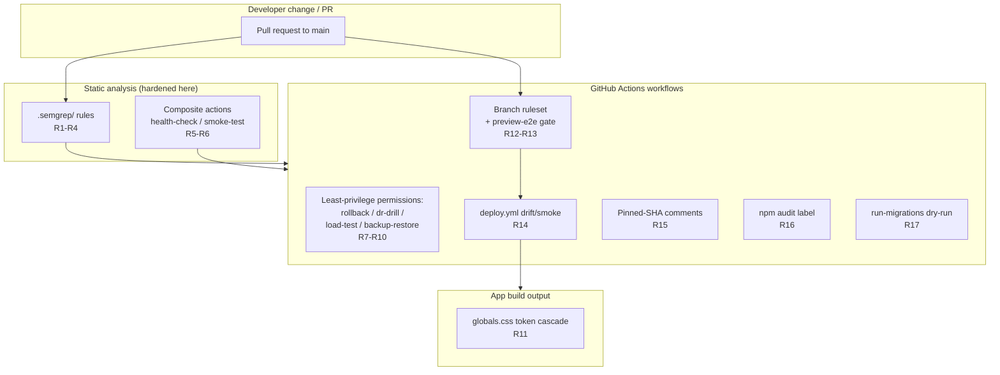

# Design Document: Audit Remediation — Increment 1 (CI/CD + Semgrep + Config Hardening)

## Overview

The `affilite-mix` repository was reviewed in a large external security/quality audit
(`affilite-mix-AUDIT(15).md`). That audit is **untrusted input**: every finding in this
design has been re-confirmed against the actual files in the repository before being
accepted as real work. The audit spans ~60 findings across CI/CD, application/library
security, data/billing integrity, and infrastructure hygiene — far too many for one
coherent design.

This spec is **Increment 1 of a planned multi-increment remediation**. It covers the
**mechanical, low-risk, high-confidence** hardening of the repository's security tooling
and pipeline configuration:

1. Strengthening the in-repo Semgrep rules (`.semgrep/nextjs-security.yml`) so they stop
   being trivially bypassable.
2. Removing shell-injection surface from the GitHub composite actions
   (`health-check`, `smoke-test`).
3. Adding least-privilege `permissions:` blocks to the four workflows that currently have
   none.
4. Resolving the `app/globals.css` design-token cascade conflict.
5. A set of related MEDIUM/LOW CI/CD policy fixes (CODEOWNERS enforcement, preview-E2E
   gate rubber-stamping, deploy drift/smoke `continue-on-error`, pinned-SHA version-comment
   drift, npm-audit label/behaviour mismatch, run-migrations dry-run keyword grep,
   load-test target-URL SSRF).

Increment 1 deliberately excludes the application/library security correctness work
(Increment 2), the data/billing integrity architecture (Increment 3), and the
infra/Docker/E2E/scripts/workers hygiene (Increment 4). Those are tracked as future
increments and are out of scope here.

> This is a separate spec from `.kiro/specs/audit-fix-verification/`, which verifies a
> different, already-applied fix set and must not be modified by this work.

## Goals and Non-Goals

**Goals**
- Make the custom Semgrep rules catch the bypass variants attackers/regressions actually use.
- Eliminate untrusted-string interpolation into composite-action shell scripts.
- Apply least-privilege `GITHUB_TOKEN` scoping to every workflow.
- Fix the CSS token cascade so `--color-primary` resolves to the intended value.
- Tighten the CI policy gaps that let unreviewed or unverified changes reach `main`.

**Non-Goals**
- No application runtime code changes (auth, csrf, r2, rate-limit, sanitize) — Increment 2.
- No DAL / billing / reconciliation / TOTP / RLS-policy changes — Increment 3.
- No Docker / local-supabase / E2E / scripts / workers changes — Increment 4.
- No change to `web-vitals.tsx` — see "Verified-False Findings" below.

## Verified-Against-Code Status

Every item below was opened and read in the current tree before inclusion.

### Verified-Real (in scope)

| # | File | Confirmed observation |
|---|------|----------------------|
| R1 | `.semgrep/nextjs-security.yml` `unsafe-redirect` | `pattern-not: NextResponse.redirect(new URL(..., request.url))` whitelists absolute-first-arg `new URL`, a real open-redirect blind spot; only matches single-arg `NextResponse.redirect($URL)`, so the `(url, 307)` status-code form bypasses; does not cover `Response.redirect(...)` or `redirect()` from `next/navigation`. Severity `WARNING`. |
| R2 | `.semgrep/nextjs-security.yml` `admin-route-missing-auth` | Only matches `export async function $METHOD(...)`; misses `export const GET = async () => …` and sync handlers. No `metavariable-regex` constraining `$METHOD` to HTTP verbs, so exported helpers in a `route.ts` file false-positive. |
| R3 | `.semgrep/nextjs-security.yml` `service-role-import` | Matches only the named-import form `import { ... } from "@/lib/server-only/service-role"`; namespace import, default import, `require()`, and dynamic `import()` all bypass. Severity `WARNING`. |
| R4 | `.semgrep/nextjs-security.yml` `raw-ip-header-parsing` | Hardcodes literal `request.headers.get("x-forwarded-for")` — misses header casing variants and the `req.` receiver name. Severity `WARNING`. |
| R5 | `.github/actions/health-check/action.yml` | Inlines `${{ inputs.cron-host }}` and `${{ inputs.cron-secret }}` directly into the `run:` script (assigned to shell vars via string interpolation). Has `set -euo pipefail`. |
| R6 | `.github/actions/smoke-test/action.yml` | Inlines `${{ inputs.host }}`, `${{ inputs.paths }}`, `${{ inputs.timeout }}` into the `run:` script **and** lacks `set -euo pipefail`. `paths` is a free-form string reachable from `workflow_dispatch`. |
| R7 | `.github/workflows/rollback.yml` | No top-level or job-level `permissions:` block. (Inputs are already passed via `env:` indirection, so its injection surface is mitigated; the permissions gap remains.) |
| R8 | `.github/workflows/dr-drill.yml` | No `permissions:` block. |
| R9 | `.github/workflows/load-test.yml` | No `permissions:` block. Also `target_url` (free-form `workflow_dispatch`/`workflow_call` string) flows unvalidated into `SITE_URL` for `scripts/load-test.mjs` → SSRF/abuse surface. |
| R10 | `.github/workflows/backup-restore-drill.yml` | No `permissions:` block. |
| R11 | `app/globals.css` | `@theme inline { --color-primary: var(--primary); … }` is followed by a later `:root { --color-primary: #1e293b; … }` block that hard-overrides the shadcn mapping, so shadcn `bg-primary`/`text-primary` no longer track `--primary`. Cascade conflict confirmed. |
| R12 | `.github/rulesets/main-protection.json` | `required_approving_review_count: 0` and `require_code_owner_review: false` → `CODEOWNERS` is never enforced as a merge gate (single-owner self-merge by design). |
| R13 | `.github/workflows/preview.yml` `preview-e2e-gate` | When `ENABLE_PREVIEW_DEPLOYS != 'true'`, both `preview` and `e2e` jobs are `skipped`; the gate emits only a `::warning::` and exits 0. The required status check "Preview E2E gate" therefore rubber-stamps green with no E2E having run. |
| R14 | `.github/workflows/deploy.yml` | `continue-on-error: true` on "Runtime drift — Worker secrets", "Runtime drift — Cron schedules", and the post-deploy E2E smoke job — drift/smoke signals cannot fail the deploy. |
| R15 | Multiple workflows | Same checkout SHA `9c091bb21b7c1c1d1991bb908d89e4e9dddfe3e0` is annotated `# v7.0.0` in some workflows and `# v4` in others (`admin-bootstrap`, `dr-drill`, `backup-restore-drill`, `rollback`, `load-test`, `deploy-gradual`, plus a `setup-node` `# v4` in `deploy.yml`). Same SHA for `actions/setup-node@48b55a0…` is `# v6` vs `# v4`. Version-comment drift confirmed. |
| R16 | `.github/workflows/security.yml` | Job is named `npm audit (high / critical)` (and that exact string is a required status-check context in the ruleset) but the command runs `npm audit --omit=dev --audit-level=moderate`. Label says high/critical; behaviour is actually moderate-and-above. Label/behaviour mismatch. |
| R17 | `.github/actions/run-migrations/action.yml` | Dry-run "syntax check" is `head -50 "$file" | grep -qE '^\s*(CREATE|ALTER|…)'` — a keyword grep, not real SQL validation; only emits a `::warning::`. |

### Verified-False (explicitly out of scope — do not re-litigate)

| File | Audit claim | Reality |
|------|-------------|---------|
| `app/web-vitals.tsx` | "Build-blocker: `next/web-vitals` removed in Next 15." | **False.** The file uses `useReportWebVitals` from `next/web-vitals`, a valid current Next 15 API. The audit's suggested fix referencing `onFID` is also wrong — FID was removed in `web-vitals` v4. **No action.** |

## Architecture

This increment changes **configuration and policy artifacts only**. There is no runtime
application architecture change. The "system under design" is the CI/CD security pipeline
and the repository's static-analysis posture.



### Change-Surface Inventory

| Area | Files touched | Risk | Validation method |
|------|---------------|------|-------------------|
| Semgrep rules | `.semgrep/nextjs-security.yml` (+ rule test fixtures) | Low (analysis-only; can raise false positives) | Semgrep fixture tests: positive (bypass variants now flagged) + negative (legitimate code not flagged) |
| Composite actions | `.github/actions/health-check/action.yml`, `.github/actions/smoke-test/action.yml` | Low | `actionlint`; manual injection-payload review |
| Workflow permissions | `rollback.yml`, `dr-drill.yml`, `load-test.yml`, `backup-restore-drill.yml` | Low | `actionlint`; workflow still runs |
| CSS cascade | `app/globals.css` | Low–Medium (visual) | Build + token-resolution assertion; visual smoke |
| Ruleset / gate policy | `.github/rulesets/main-protection.json`, `.github/workflows/preview.yml` | Medium (governance) | JSON validity; documented decision; gate logic test |
| deploy.yml drift/smoke | `.github/workflows/deploy.yml` | Medium | `actionlint`; documented decision |
| SHA version comments | all workflow + action YAML | Low | comment-vs-tag consistency check script |
| npm-audit label | `.github/workflows/security.yml` (+ ruleset context if renamed) | Low | name/ruleset-context consistency check |
| run-migrations dry-run | `.github/actions/run-migrations/action.yml` | Low | dry-run executes real parse-only validation |

## Components and Interfaces

### Component 1: Hardened Semgrep Ruleset

**Purpose**: Detect the security anti-patterns the existing rules miss, across the realistic
set of code shapes (bypass variants), without flooding the build with false positives.

**Interface** (rule contract, expressed as detection behaviour):

```pascal
RULE unsafe-redirect
  DETECTS:
    NextResponse.redirect($URL)                 // single-arg
    NextResponse.redirect($URL, $STATUS)        // status-code form (R1)
    Response.redirect($URL, ...)                // platform Response (R1)
    redirect($URL)        FROM "next/navigation"// next/navigation (R1)
  ALLOWS (pattern-not):
    *.redirect(safeRedirectUrl(...))
    NextResponse.redirect(new URL($RELATIVE, request.url))  // ONLY when first arg is a
                                                            // relative/literal path, NOT a
                                                            // variable that may be absolute
  SEVERITY: ERROR        // raised from WARNING

RULE admin-route-missing-auth
  DETECTS handlers exported as BOTH:
    export async function $METHOD(...) { ... }
    export const $METHOD = async (...) => { ... }      // R2
  CONSTRAINS:
    metavariable-regex: $METHOD matches ^(GET|POST|PUT|PATCH|DELETE|HEAD|OPTIONS)$  // R2
  ALLOWS (pattern-not): bodies invoking requireAdmin / requireSuperAdmin /
                        requireAdminSession / withAuthz(...)
  SCOPE: **/app/api/admin/**/route.{ts,tsx}
  SEVERITY: ERROR

RULE service-role-import
  DETECTS all import shapes of "@/lib/server-only/service-role":  // R3
    import { ... } from "..."
    import * as $NS from "..."
    import $DEFAULT from "..."
    require("...")
    import("...")               // dynamic
  SEVERITY: ERROR        // raised from WARNING (gates on allowlist + CODEOWNER)

RULE raw-ip-header-parsing
  DETECTS (case-insensitive header, receiver-agnostic):              // R4
    $REQ.headers.get("x-forwarded-for")  where $REQ in {request, req, ...}
    plus "X-Forwarded-For" / "X-FORWARDED-FOR" casings
  ALLOWS (pattern-not-inside): function getClientIp(...) { ... }
  SEVERITY: WARNING (unchanged) OR ERROR  // decision: see Open Questions
```

**Responsibilities**
- Each rule ships with paired test fixtures: a "should-flag" file containing every bypass
  variant and a "should-not-flag" file containing the legitimate, approved usage.
- Severity choices are explicit and documented in the rule `metadata`.

> **Severity note for the gate**: `security.yml` runs an advisory full scan (SARIF, never
> fails) and a **blocking** `--severity ERROR --error` gate. Raising `unsafe-redirect`,
> `admin-route-missing-auth` (already ERROR), and `service-role-import` to `ERROR` makes
> them blocking. The `service-role-import` allowlist workflow (`lib/security/service-role-allowlist.ts`)
> must be re-validated so legitimate allowlisted imports do not break the build — see Risks.

### Component 2: Injection-Safe Composite Actions

**Purpose**: Pass all caller-controlled inputs into shell via environment-variable
indirection so a malicious input string can never be interpreted as shell syntax.

**Interface** (action contract):

```pascal
ACTION health-check / smoke-test
  PRINCIPLE: NO ${{ inputs.* }} expression appears inside a run: script body.
  INSTEAD:
    env:
      CRON_HOST:   ${{ inputs.cron-host }}     // expansion happens in the env: map
      CRON_SECRET: ${{ inputs.cron-secret }}
    run: |
      set -euo pipefail                        // REQUIRED in every composite run block (R6)
      # reference "$CRON_HOST" / "$CRON_SECRET" as ordinary shell vars
  smoke-test ADDITIONAL:
    - host MUST match ^[A-Za-z0-9.-]+$ (hostname allowlist) before use
    - paths split safely; each entry validated as a leading-"/" path
```

**Responsibilities**
- Move every `${{ inputs.* }}` reference out of `run:` bodies into `env:`.
- Add `set -euo pipefail` to `smoke-test` (health-check already has it).
- Reject malformed `host`/`paths` early with a clear `::error::`.

### Component 3: Least-Privilege Workflow Permissions

**Purpose**: Every workflow declares the minimum `GITHUB_TOKEN` scope it needs instead of
inheriting the broad repository default.

**Interface**:

```pascal
FOR EACH workflow IN {rollback, dr-drill, load-test, backup-restore-drill}:
  ADD top-level:
    permissions:
      contents: read        // default-deny baseline; none of these need write scope
  // job-level overrides ONLY if a specific job demonstrably needs more (none identified)
```

**Responsibilities**
- Match the established pattern already used by `deploy.yml`, `preview.yml`, `security.yml`
  (top-level `contents: read`, opt-in per job).
- Confirm none of the four workflows call APIs needing write scope (checkout, curl, psql,
  wrangler rollback via `CLOUDFLARE_API_TOKEN`, and node scripts do not need `GITHUB_TOKEN`
  write).

### Component 4: CSS Design-Token Cascade Fix

**Purpose**: Make `--color-primary` (and the sibling shadcn utility tokens) resolve to a
single intended value, removing the conflict between the `@theme inline` shadcn mapping and
the later tenant `:root` override.

**Interface** (token resolution contract):

```pascal
INVARIANT token-single-source:
  For the shadcn utility key --color-primary, exactly ONE of these holds by design:
    (a) --color-primary := var(--primary)         // shadcn-driven, tenant sets --primary
    (b) --color-primary := <tenant literal>        // tenant-branding-driven
  The current file asserts BOTH; the fix chooses one source of truth and documents it.
```

**Responsibilities**
- Decide the intended source of truth (see Open Questions): either (a) tenants override
  `--primary` and the `@theme inline` mapping flows through, or (b) the tenant brand tokens
  are renamed off the reserved `--color-*` shadcn namespace (e.g. `--brand-primary`) so they
  stop clobbering the shadcn mapping.
- Preserve existing tenant branding behaviour and dark-mode tokens.

### Component 5: CI Policy & Provenance Fixes

**Purpose**: Close the governance/provenance gaps that let unverified changes look "green".

**Interface** (policy contracts):

```pascal
POLICY codeowners-enforcement (R12):
  EITHER enforce: require_code_owner_review = true AND required_approving_review_count >= 1
  OR document explicitly: single-owner repo, CODEOWNERS is advisory-only
  // decision required — see Open Questions

POLICY preview-e2e-gate (R13):
  WHEN preview+e2e skipped AND branch is protected (main):
    gate MUST NOT silently pass; require a labeled, expiring exception
    (skip-preview-e2e) OR fail

POLICY deploy-drift-smoke (R14):
  drift and post-deploy smoke results MUST be visible and, per decision, either
  block the deploy or emit a tracked alert — not be silently swallowed by
  continue-on-error

POLICY sha-comment-consistency (R15):
  For every `uses: $action@$sha # $comment`, $comment MUST equal the tag that
  $sha actually points to. A repo check enforces this.

POLICY audit-label-truth (R16):
  The npm-audit job NAME and the ruleset required-check CONTEXT MUST describe the
  actual --audit-level. Rename to "npm audit (moderate+)" (and update the ruleset
  context in lockstep) OR change the level to match the label.

POLICY migration-dry-run (R17):
  Dry-run MUST perform real parse-only validation (e.g. psql in a throwaway
  transaction / `--dry-run` parse) rather than a head/grep keyword scan.
```

**Responsibilities**
- Keep `main-protection.json` required-check contexts and workflow job names in lockstep
  (renaming a job name breaks the required-status-check binding).

## Data Models

This increment manipulates declarative configuration. The relevant "data models" are the
config schemas themselves.

### Model 1: Semgrep Rule (subset)

```pascal
STRUCTURE SemgrepRule
  id: String
  patterns | pattern: PatternExpr            // pattern / patterns / pattern-either
  metavariable-regex: Map<Metavar, Regex>    // NEW for admin-route-missing-auth
  paths: { include: List<Glob> }
  message: String
  languages: List<"typescript" | "javascript">
  severity: "ERROR" | "WARNING" | "INFO"
  metadata: { category: String, audit-ref: String }
END STRUCTURE
```

**Validation Rules**
- `semgrep --validate --config .semgrep/` passes.
- Every rule has at least one positive and one negative fixture.

### Model 2: GitHub Workflow Permissions

```pascal
STRUCTURE Permissions
  contents: "read" | "write" | "none"
  // all other scopes default to "none" once any permissions: block is present
END STRUCTURE
```

**Validation Rules**
- Presence of a top-level `permissions:` block flips all unlisted scopes to `none`.
- `actionlint` parses the workflow without error.

### Model 3: Branch Ruleset (subset)

```pascal
STRUCTURE PullRequestRule
  required_approving_review_count: Integer   // currently 0 (R12)
  require_code_owner_review: Boolean         // currently false (R12)
STRUCTURE RequiredStatusChecks
  required_status_checks: List<{ context: String }>   // must match job names exactly
END STRUCTURE
```

**Validation Rules**
- `context` strings exactly equal the corresponding workflow job `name:` values.

### Model 4: Pinned Action Reference

```pascal
STRUCTURE ActionRef
  owner_repo: String
  sha: 40-hex-commit
  comment_tag: String     // must resolve to `sha`
END STRUCTURE
```

## Error Handling

| Scenario | Condition | Response | Recovery |
|----------|-----------|----------|----------|
| Semgrep false positive after hardening | A legitimate, reviewed construct now matches an ERROR rule | Build fails on the Semgrep ERROR gate with the rule message | Add a precise `pattern-not` / allowlist entry, or `# nosemgrep:<rule-id>` with justification; re-run fixtures |
| Composite-action input rejected | `host`/`paths` fails the allowlist regex | `::error::` with the offending value name (not the value) and non-zero exit | Caller supplies a valid hostname/path |
| Workflow loses needed scope | A job actually needed a write scope removed by least-privilege | Job step fails with a 403 from the GitHub API | Add the minimal job-level `permissions:` override for that one job |
| CSS regression | Token fix changes a rendered colour unexpectedly | Visual smoke / Lighthouse contrast check flags it | Adjust the chosen source-of-truth mapping |
| SHA-comment check fails | A pinned action's comment no longer matches its tag | CI check fails listing the mismatches | Correct the comment (or repin) |

**Principle**: error messages must reference input **names**, never secret **values**
(`cron-secret` etc.), and composite actions must not echo secrets.

## Correctness Properties

> This section is populated in the Requirements phase. After requirements are generated,
> each property below will be cross-referenced with the specific acceptance criteria it
> validates (`**Validates: Requirements X.Y**`). Because Increment 1 is predominantly
> declarative configuration hardening, most acceptance criteria are validated by
> **fixture/example tests** (Semgrep positive/negative fixtures, `actionlint`, JSON-schema
> validity, a CSS token-resolution assertion) rather than by property-based testing. The
> few genuinely universal properties — Semgrep detection completeness across a *family* of
> bypass variants, and SHA-comment consistency across *all* pinned actions — are candidates
> for property-style tests and will be captured here.

_(Properties and their requirement references are added after the requirements document is
approved.)_

## Testing Strategy

### Static / Fixture Testing (primary for this increment)
- **Semgrep fixtures**: for each hardened rule, a `should-flag` fixture enumerating the
  bypass variants (R1–R4) and a `should-not-flag` fixture of approved usage. Run
  `semgrep --test`.
- **actionlint**: lint all changed workflows and composite actions.
- **JSON validity**: validate `main-protection.json` parses and required-check contexts
  match job names.
- **SHA-comment consistency**: a small repo check asserting every `@<sha> # <tag>` comment
  matches the tag the SHA resolves to (R15).

### Property-Style Testing (where a universal statement genuinely holds)
- **Semgrep detection completeness**: for the generated family of redirect call-forms in
  the documented bypass set, the `unsafe-redirect` rule flags all unsafe members and none
  of the safe members.
- **SHA-comment consistency**: for *all* pinned action references in the repo, comment
  equals resolved tag.

### Example / Integration Testing
- **Composite action injection**: run `smoke-test` / `health-check` with a crafted
  `paths`/`host` payload (e.g. `"; curl evil "`) and assert no injected command executes
  and the action rejects or safely ignores it.
- **Preview-E2E gate**: simulate the skipped-skipped case on a protected branch and assert
  the gate does not silently pass (R13).
- **run-migrations dry-run**: feed a syntactically invalid `.sql` and assert dry-run fails
  (R17).

### Out of scope for testing here
- No property-based testing of infrastructure behaviour, AWS/Cloudflare runtime, or UI
  rendering — those are not functions with meaningful "for all inputs" semantics.

## Security Considerations

- **Workflow-injection (R5, R6, R9)**: `workflow_dispatch`/`workflow_call` string inputs
  are attacker-influenceable by anyone with write access; env-indirection + `set -euo
  pipefail` + input allowlists remove the shell-injection and limit SSRF abuse.
- **Token blast radius (R7–R10)**: default `GITHUB_TOKEN` scope is broad; least-privilege
  reduces what a compromised step can do.
- **Detection bypass (R1–R4)**: weak Semgrep rules give false assurance; hardening restores
  the intended guardrail. Raising severities to ERROR makes select rules blocking — this is
  a deliberate trade-off requiring the allowlist re-validation noted in Risks.
- **Provenance (R15, R16)**: misleading version comments and audit labels erode trust in CI
  signals; making them truthful is a low-cost integrity win.

## Performance Considerations

Negligible. Semgrep already runs in CI; additional fixtures and slightly broader patterns
add seconds, not minutes. No runtime/application performance impact.

## Dependencies

- **Semgrep** `1.165.0` (already pinned in `security.yml`) — `metavariable-regex`,
  `pattern-either`, and `--test` are all supported.
- **actionlint** — recommended addition to CI for workflow/action linting (may already be
  present; to be confirmed during requirements/tasks).
- **GitHub Actions** `permissions:` schema (native).
- **Tailwind v4 `@theme inline`** semantics — the CSS fix must respect the reserved
  `--color-*` namespace behaviour.
- No new application runtime dependencies.

## Open Questions (to resolve during Requirements)

1. **Semgrep severities**: raise `unsafe-redirect` and `service-role-import` to `ERROR`
   (blocking) now, or keep advisory `WARNING` until the allowlist/fixtures are proven clean?
2. **CSS source of truth**: should tenant branding flow through `--primary` (option a), or
   should tenant tokens move off the reserved `--color-*` namespace (option b)?
3. **CODEOWNERS (R12)**: enforce code-owner review (`require_code_owner_review: true`,
   review count ≥ 1) or formally document the single-owner advisory-only model?
4. **deploy.yml drift/smoke (R14)**: convert `continue-on-error` signals into a blocking
   gate, or into a tracked non-blocking alert (e.g. Slack/Sentry) with a documented SLA?
5. **npm-audit (R16)**: rename the job/ruleset context to "moderate+", or change the audit
   level back to high to match the existing label?
```
