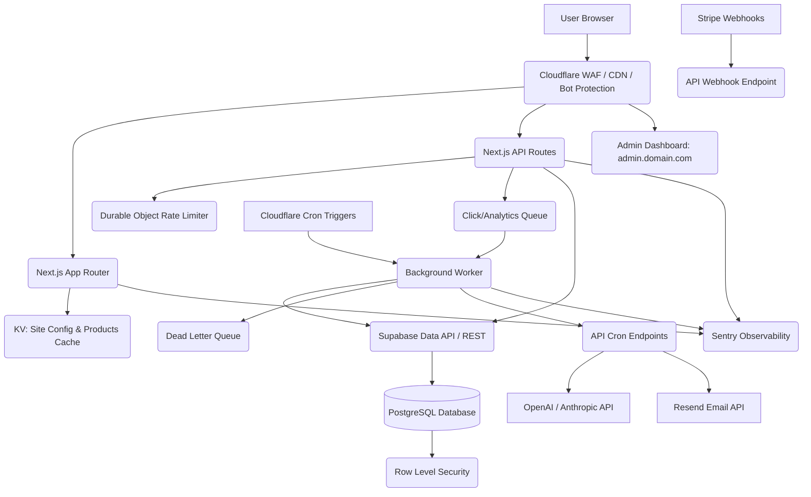

# Production Architecture Diagram

## Data Flow
- **Browser** requests hit the **Cloudflare WAF** where DDOS, Rate Limits, and Bot Management rules apply.
- Dynamic requests hit the **Next.js** edge workers which validate `sameSite` JWTs and resolve the current tenant domain via **KV**.
- Heavy click analytics are fired and forgotten into **Cloudflare Queues** and processed asynchronously.
- The **Supabase Data API** applies RLS on behalf of the `anon` or `authenticated` JWT role.
- Background tasks (Sitemaps, AI Generation, Price Scraping) are scheduled via **Cron Triggers**, securely invoking API routes with timing-safe secrets.
